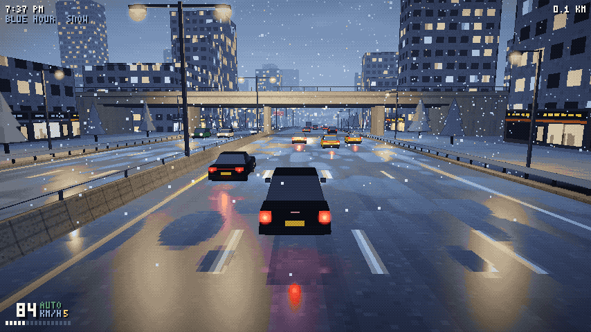

# Pixel Commute

An endless, relaxing highway drive: a real 3D world drawn as pixel art. It's blue hour,
snow is falling, sodium lamps hum, tail lights smear across the wet tarmac and the city
drifts past. There's no score to chase and no way to lose; you just drive.

**Play it: https://nikunjsingh93.github.io/pixel-commute/** (works offline and installs as an
app: "Add to Home Screen" on phones, the install button in desktop Chrome or Edge.)



## Run

```bash
npm install
npm run dev        # http://localhost:5212
npm run build      # static build in dist/
npm run deploy     # build + publish to the gh-pages branch (GitHub Pages)
```

## Controls

| Key | Action |
| --- | --- |
| `W` `S` / `↑` `↓` | gas, brake (hold `S` when stopped to reverse) |
| `A` `D` / `←` `→` | steer |
| `Shift` | handbrake |
| `Space` | autopilot: keeps a lane, follows traffic, overtakes slow cars |
| `C` | camera: chase, far (default), cockpit, bumper, cinema |
| `T` | next time of day: dawn, day, afternoon, sunset, blue hour, evening, night |
| `R` | weather: snow, rain, clear, fog |
| `M` / `N` | radio on/off, next station (generative lo-fi) |
| `[` `]` | pixel size (render resolution) |
| `P` | palette mode: 8-bit palette, posterize, raw |
| `Esc` | pause, with the full list of controls |
| `U` / `H` | hide HUD / quick help |

Gamepad: left stick steers (analog), RT/LT for gas and brake, A for the handbrake.

**Touch screens** get on-screen controls laid out like Open Road's: steering arrows bottom-left;
Gas, Brake and Handbrake bottom-right; and one ☰ menu button top-right. The menu pauses the game
and holds everything else: Camera, Autopilot, Time, Weather, Radio, Station, Resolution and
Fullscreen, each showing its current setting. Resolution steps through the clean pixel scales your
screen allows; the choice is remembered (so are `[` `]` on desktop). Tap Resume, or anywhere outside the menu, to keep driving.

## Install / offline (PWA)

The page ships a web app manifest, pixel-art icons and a service worker (`public/sw.js`). After
the first visit the game runs offline. Installed, it opens fullscreen in landscape with no
browser chrome. The service worker is only registered in production builds, so the dev server
is never cached.

## Driving physics

The car is a simcade rigid body, ported from the Open Road project (`src/vehicle.js`):

* four raycast wheels with spring/damper suspension and anti-roll bars, so the body pitches
  under braking and rolls in corners;
* a combined-slip tyre model (Pacejka-style curve). Grip drops in rain and slush;
* a 560 Nm rear-drive engine with a torque curve, an 8-speed automatic gearbox, ABS,
  traction control and a light yaw-stability assist;
* front-wheel steering with Ackermann geometry. The car rotates about its axles, so the nose
  leads into a turn and the rear follows. Steering lock is speed-sensitive: full lock always
  turns as hard as the tyres allow (about 1 g), while small taps stay smooth at speed;
* barriers and traffic push back with impulses at the contact point. A clipped corner turns
  the car; a rear-end slows it, and the other car gets shoved too.

The cockpit camera sits in the driver's seat (left-hand drive). It has a dashboard with a live
pixel instrument cluster (speed, gear, rpm bar), a radio display, a steering wheel that turns
with the front wheels, A-pillars, door mirrors and a rear-view mirror.

## The city

Most of the highway runs open through the city: steel guard rails on both edges, pavements with
street lights and pine trees, a row of shops with lit windows right along the road, and taller
towers behind. Now and then the road dips into a short walled cutting with the city on top.
Overpasses land on abutments, and lit billboards and green gantry signs pass overhead.

## How the pixel-art look works

1. The scene is genuine 3D (Three.js): streamed road chunks, guard rails, retaining walls, overpasses,
   lamp posts, city blocks and low-poly traffic, lit by a hemisphere light, a pool of
   point lights that follows the camera through the sodium lamps, and the player's headlights.
2. It renders into a low-res HDR target, about 575 lines tall by default, at a whole number of
   screen pixels per game pixel (`[` `]` change it; `?px=200` gives the chunkiest look). The HUD
   always stays at about 200 lines, so its pixel font stays chunky.
3. A post pass tonemaps it, darkens depth edges (pixel outlines), applies a 4×4 Bayer
   dither and snaps every pixel to a 62-colour palette taken from the reference art.
4. That low-res image goes straight into a canvas that CSS upscales with
   `image-rendering: pixelated`, using an integer number of device pixels per game pixel.

The night glow is fake but cheap. Every lamp, tail light, indicator and aviation light is
one additive point sprite in a single draw call. On a wet road each light also gets a
vertical reflection streak, placed where its mirror image meets the road for the current
camera.

## Layout

```
public/      manifest, service worker, icons (copied as-is into the build)
scripts/     deploy.mjs (gh-pages)
src/
  main.js      loop, input, cameras, lighting, floating origin, dev hooks
  path.js      endless centre line (curvature + elevation noise)
  world.js     64 m chunk builder: carriageways, barriers, walls, lamps, bridges, signs, buildings
  cars.js      low-poly vehicles from tapered boxes (sedan, lux, hatch, SUV, van, truck, bus)
  traffic.js   IDM car following + lane changes, oncoming traffic, light sprites
  vehicle.js   rigid-body car: suspension, tyres, engine, gearbox, ABS/TC (from Open Road)
  player.js    player car on the highway: barrier/traffic impulses, close calls, autopilot
  cockpit.js   interior for the cockpit camera: dash, cluster, wheel, pillars, mirrors
  touch.js     on-screen touch controls + the touch menu
  pixel.js     low-res render target + palette/dither/outline post pass
  sky.js       time-of-day keyframes, sky dome, stars, moon, skyline band
  fx.js        glow/streak sprites and the camera-following light pool
  weather.js   snow points / rain lines wrapped around the camera
  hud.js       pixel HUD, title screen, help (3×5 bitmap font in font.js)
  audio.js     synthesised engine, tyres, rain and the lo-fi radio
  textures.js  canvas-drawn road, concrete, facades, skyline, signs
```

Dev helpers: open `?dev=1&hold=1&play=1` to stop the render loop, then use
`__game.advance(seconds)` and `await __game.snap('name')`, which writes `shots/name.png`
through the dev server. Other URL params: `t` (hour), `w` (weather index), `cam`, `px`
(pixel height), `seed`.
